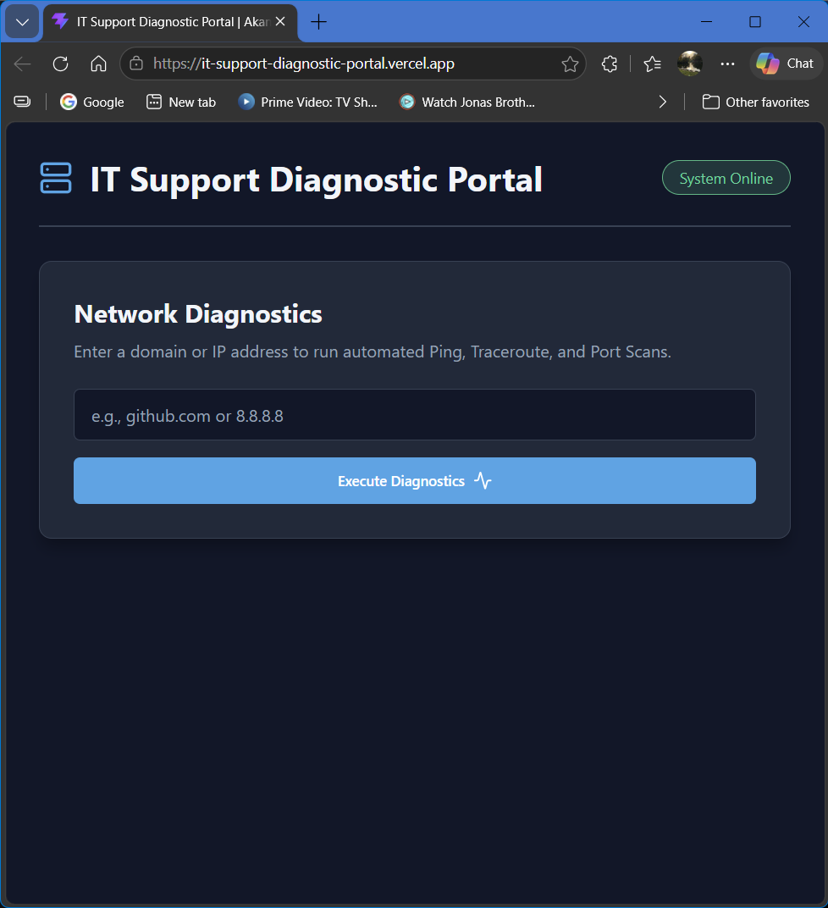
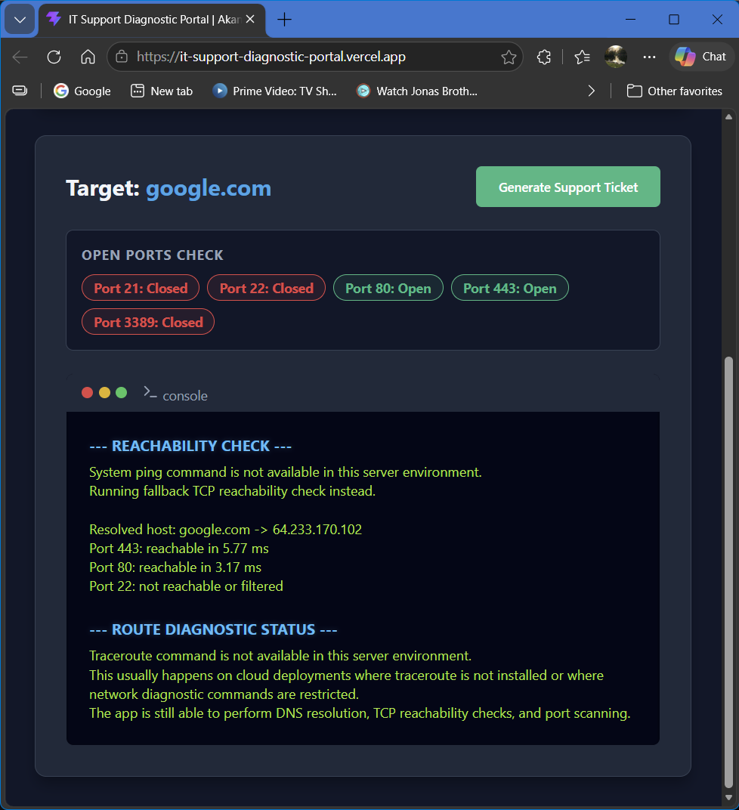
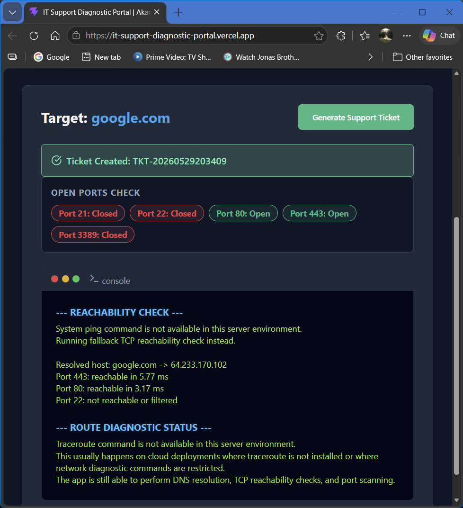

# IT Support Diagnostic Portal — Frontend

A React + Vite frontend for an IT support dashboard that lets support agents run network diagnostics, view ping/traceroute/port scan results, and generate support tickets.

## Project Purpose

This project was built as a portfolio-ready full-stack application to demonstrate frontend development, API integration, responsive UI design, and practical IT support tooling.

The frontend connects to a FastAPI backend that performs diagnostic checks and returns network results in a clean dashboard interface.

## Tech Stack

- React
- Vite
- Axios
- Lucide React
- CSS variables
- FastAPI backend integration
- Vercel-ready deployment configuration

## Features

- Enter a domain or IP address for diagnostics
- Run backend-powered diagnostic checks
- Display ping or fallback TCP reachability results
- Display traceroute or cloud-environment fallback messaging
- Display open/closed port scan results
- Generate a mock support ticket from diagnostic results
- Loading, error, and success states
- Responsive dashboard layout
- Professional dark-mode interface
- Deployment-ready API configuration with environment variables

## Screenshots

### Diagnostic Form



### Diagnostic Results



### Ticket Created



## Live Demo

Frontend: https://it-support-diagnostic-portal.vercel.app
Backend API: https://it-support-api-g0b4.onrender.com  
API Docs: https://it-support-api-g0b4.onrender.com/docs

## Environment Variables

Create a `.env` file in the project root:

```env
VITE_API_BASE_URL=https://it-support-api-g0b4.onrender.com
```

For local backend testing, use:

```env
VITE_API_BASE_URL=http://127.0.0.1:8000
```

The `.env` file should not be committed. Use `.env.example` to show the required variable.

## Run Locally

Install dependencies:

```bash
npm install
```

Start the development server:

```bash
npm run dev
```

The app will run at:

```text
http://localhost:5173
```

## Build

Create a production build:

```bash
npm run build
```

Preview the production build locally:

```bash
npm run preview
```

## Backend Repository

Backend repo: `AC0731/it-helpdesk-backend`

The backend is built with FastAPI and provides the diagnostic and ticket-generation API endpoints used by this frontend.

## API Endpoints Used

```http
POST /api/diagnostics
POST /api/ticket
```

## Deployment Notes

This frontend is prepared for deployment on Vercel.

When deploying, add this environment variable in Vercel:

```env
VITE_API_BASE_URL=https://it-support-api-g0b4.onrender.com
```

After setting the environment variable, redeploy the project so Vercel includes it in the production build.

## Testing Completed

The frontend production build was tested with:

```bash
npm run build
```

The app was also tested locally with:

- A diagnostic search using `google.com`
- Port scan results
- Ping fallback results
- Traceroute fallback results
- Support ticket generation

## Notes About Ping and Traceroute

Some deployed server environments do not provide system-level `ping` or `traceroute` commands.

When those commands are unavailable, the backend returns clean fallback messages instead of showing raw server errors. The app can still show DNS resolution, TCP reachability checks, port scanning, and support ticket creation.

## Author

Akanksha Chavda  
GitHub: AC0731