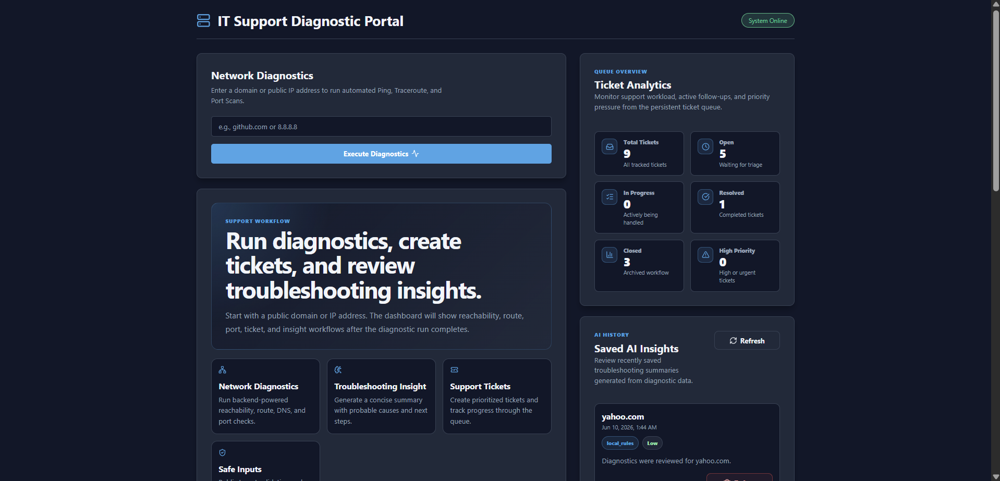
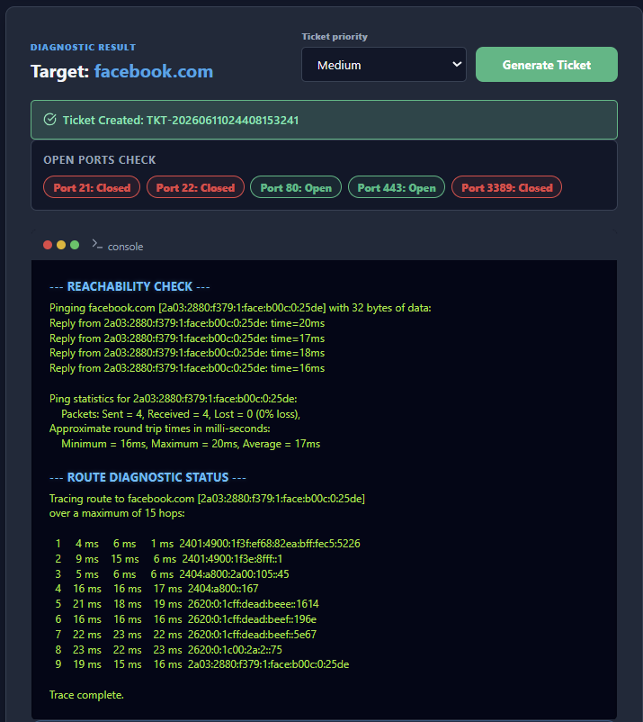
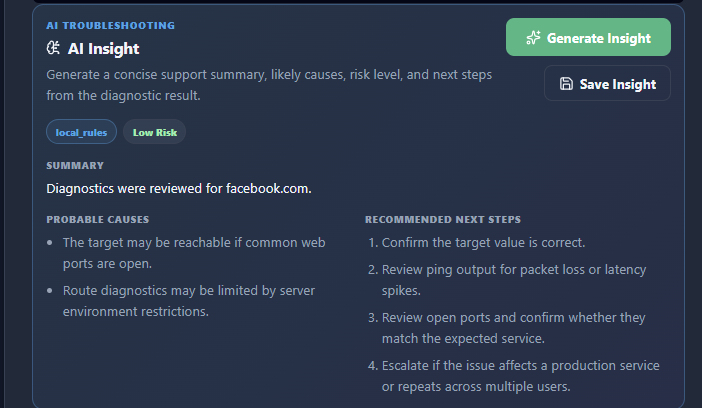
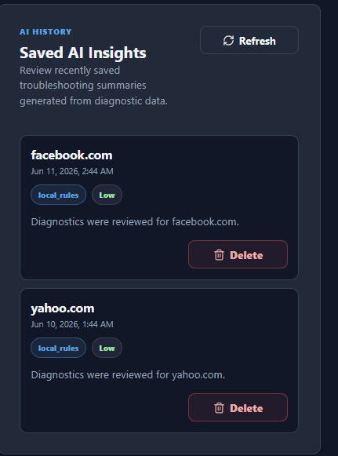
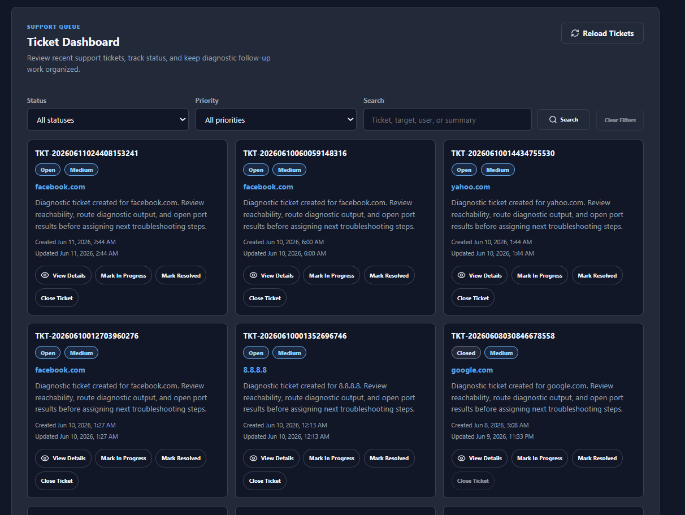
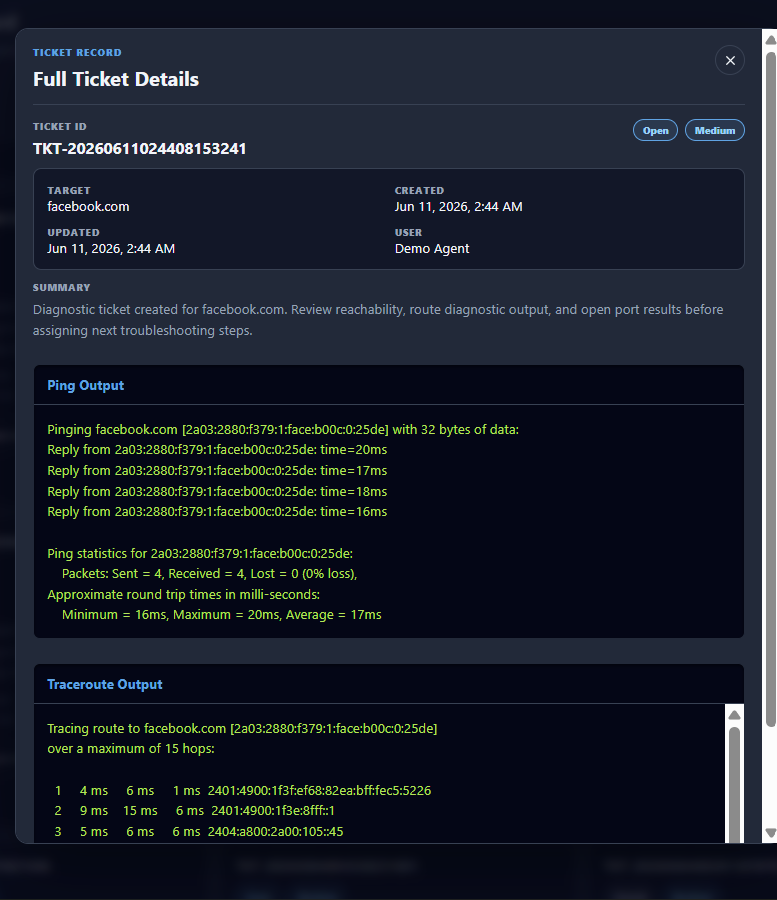

# SupportOps Diagnostic Portal - Frontend

React + Vite frontend for a support operations dashboard that connects to a FastAPI diagnostic backend.

I built this as a full-stack portfolio project around a realistic IT support workflow: run diagnostics on a public target, review the technical output, generate a troubleshooting summary, save useful insight history, and create support tickets from the results.

The main goal was to make the app feel like a small internal tool a support technician could actually use, not just a static dashboard with mock cards.

## Live Demo

Frontend:

```text
https://it-support-diagnostic-portal.vercel.app
```

Backend API:

```text
https://it-support-api-g0b4.onrender.com
```

Backend API Docs:

```text
https://it-support-api-g0b4.onrender.com/docs
```

## What I Built

This frontend is the UI layer for a support diagnostics and ticket workflow.

It includes:

- a diagnostic form for public domains and IP addresses
- reachability, route, and port result display
- support ticket creation from diagnostic output
- ticket priority selection
- ticket analytics
- ticket status updates
- searchable and filterable ticket queue
- full ticket detail modal
- troubleshooting insight generation
- saved insight history
- delete confirmation modal for saved insights
- loading, empty, success, and error states
- reusable API helper modules
- reusable React components
- frontend test coverage
- Vercel deployment setup

The backend handles validation, diagnostics, ticket storage, analytics, saved insight history, and the backend-only troubleshooting insight flow.

## Screenshots

### Dashboard overview



### Diagnostic result and ticket creation



### Troubleshooting insight



### Saved insight history



### Ticket dashboard



### Full ticket record



## Main Workflow

1. Enter a public domain or IP address.
2. Run diagnostics through the backend.
3. Review reachability, route, and open port results.
4. Generate a troubleshooting insight from the diagnostic output.
5. Save the insight if it is useful for later review.
6. Choose a ticket priority.
7. Create a support ticket from the diagnostic result.
8. Track the ticket in the dashboard.
9. Filter tickets by status, priority, or search query.
10. Open full ticket details when more evidence is needed.

## Features

### Diagnostics

- Public domain/IP input
- Backend-powered reachability checks
- Route diagnostic output
- Open port result display
- Clean fallback messages when ping or traceroute are restricted by the environment
- Validation handling for unsafe or unsupported targets

### Ticket workflow

- Generate support tickets from diagnostic results
- Select ticket priority before creation
- View ticket queue
- Filter by status and priority
- Search by ticket, target, user, or summary
- Show a no-match message when a search returns no results
- Update ticket status from the dashboard
- Open a full ticket record modal

### Troubleshooting insight workflow

- Generate a structured troubleshooting summary from diagnostic evidence
- Show probable causes, recommended next steps, and risk level
- Save useful insights to history
- Prevent duplicate saved insights on the backend
- Delete saved insights with a custom confirmation modal
- Refresh saved insight history without reloading the whole page

### UI states

- Loading states
- Empty states
- Success messages
- Error messages
- Disabled buttons when actions are not available
- Responsive layout for desktop and smaller screens

## Tech Stack

- React
- Vite
- JavaScript
- Axios
- Lucide React
- CSS variables
- Vitest
- Testing Library
- ESLint
- GitHub Actions
- Vercel

## Repository Pair

This frontend is part of a full-stack project.

Frontend repo:

```text
AC0731/it-helpdesk-frontend
```

Backend repo:

```text
AC0731/it-helpdesk-backend
```

The backend is built with FastAPI and provides the diagnostic, ticket, analytics, and troubleshooting insight APIs used by this frontend.

## API Endpoints Used

```text
POST /api/diagnostics
GET /api/diagnostics/history

POST /api/ticket
GET /api/tickets
GET /api/tickets/{ticket_id}
PATCH /api/tickets/{ticket_id}
GET /api/tickets/analytics

POST /api/ai/insight
POST /api/ai/insight/save
GET /api/ai/insights
DELETE /api/ai/insights/{insight_id}
```

## Project Structure

```text
src/
  api/
    ai.js
    client.js
    diagnostics.js
    tickets.js

  components/
    AIInsightPanel.jsx
    AlertBanner.jsx
    DashboardHeader.jsx
    DiagnosticsForm.jsx
    DiagnosticsResults.jsx
    PortScannerResults.jsx
    SavedAIInsightsPanel.jsx
    StatusBadge.jsx
    TerminalOutput.jsx
    TicketAnalytics.jsx
    TicketDashboard.jsx
    TicketDetailModal.jsx

  pages/
    Dashboard.jsx

  styles/
    base.css
    layout.css
    ui.css
    tickets.css
    insights.css
    responsive.css
```

I split the CSS into smaller files because the first version of the stylesheet was getting hard to work with. It is still plain CSS, but separating layout, tickets, insight panels, and base styles made the final polish easier to manage.

## Environment Variables

Create a local `.env.local` file in the project root:

```text
VITE_API_BASE_URL=http://127.0.0.1:8000
```

For production:

```text
VITE_API_BASE_URL=https://it-support-api-g0b4.onrender.com
```

Do not commit `.env.local`.

Use `.env.example` as the safe template.

## Run Locally

Install dependencies:

```bash
npm install
```

Start the development server:

```bash
npm run dev
```

The app will run at:

```text
http://localhost:5173
```

## Local Full-Stack Testing

Start the backend first:

```powershell
cd C:\Users\akank\it-helpdesk-backend
.\venv\Scripts\Activate.ps1
uvicorn app.main:app --reload
```

Then start the frontend:

```powershell
cd C:\Users\akank\it-helpdesk-frontend
npm run dev
```

Manual smoke test:

- Load the dashboard.
- Run diagnostics with `google.com`, `facebook.com`, or `8.8.8.8`.
- Confirm reachability, route, and port results render.
- Generate a troubleshooting insight.
- Save the insight.
- Confirm saved insight history refreshes.
- Select ticket priority.
- Generate a support ticket.
- Confirm the ticket appears in the dashboard.
- Open the ticket detail modal.
- Change ticket status to In Progress.
- Change ticket status to Resolved.
- Test status, priority, and search filters.
- Try a search that does not match any tickets.
- Delete a saved insight and confirm the custom modal appears.

## Scripts

```bash
npm run dev
npm run build
npm run preview
npm run lint
npm test
npm run test:watch
```

## Testing

Run linting:

```bash
npm run lint
```

Run automated tests:

```bash
npm test
```

Run production build:

```bash
npm run build
```

Current automated coverage includes:

- status badge rendering
- diagnostics form behavior
- diagnostics result rendering
- ticket priority selection
- ticket dashboard loading and empty states
- ticket status updates
- ticket filtering behavior
- ticket analytics rendering
- ticket detail modal behavior
- troubleshooting insight panel behavior
- saved insight history behavior
- API helper behavior

## CI

This project includes a GitHub Actions workflow that runs on pull requests and pushes to `main`.

The workflow checks:

- dependency installation
- linting
- automated frontend tests
- production build

## Deployment

This frontend is deployed on Vercel.

Production environment variable:

```text
VITE_API_BASE_URL=https://it-support-api-g0b4.onrender.com
```

After changing environment variables in Vercel, redeploy the project so the value is included in the production build.

More details are available in:

```text
docs/deployment.md
```

## Architecture Notes

The frontend is organized around a simple separation:

- API files handle backend requests.
- Components handle UI and user interaction.
- The dashboard page connects the workflow together.
- Styling is split by purpose so the dashboard does not depend on one oversized CSS file.

The frontend does not store secrets. Troubleshooting insight generation is requested through the backend, so API keys stay out of the React app.

More details are available in:

```text
docs/architecture.md
```

## Operational Notes

A few practical notes from testing the app locally and in deployment:

- `Reload Tickets` re-fetches the ticket queue from the backend. It does not rerun diagnostics.
- Saved insight refresh works separately from the ticket queue.
- Traceroute can timeout or be restricted depending on the server environment.
- The hosted backend may return fallback diagnostic messages when system-level network commands are not available.
- Local development uses SQLite through the backend.
- The workflow is intended for public diagnostic targets only.
- The saved insight delete action only removes the saved insight record. It does not delete diagnostic output or support tickets.

## Problems I Ran Into

A few things took more work than expected:

- Browser DELETE requests failed at first because the backend CORS preflight did not allow `DELETE`.
- Saved insights needed duplicate protection so the same diagnostic result would not keep creating repeated saved records.
- The first ticket dashboard layout was too cramped inside the right column, so I moved it into a full-width queue section.
- Search needed two different states: empty search input and no matching ticket results.
- The browser `confirm()` delete popup looked unfinished, so I replaced it with a custom modal.
- Ping and traceroute behavior was different between local development and the hosted backend, so the UI needed to handle fallback messages cleanly.
- CSS got messy during the final UI pass, so I split the styles and cleaned the ticket dashboard rules instead of continuing to stack overrides.

## What I Would Improve Next

If I kept building this project, I would add:

- user authentication and role-based access
- ticket comments or internal notes
- ticket assignment
- pagination for long ticket queues
- exportable diagnostic reports
- more detailed analytics charts
- better audit history for ticket status changes
- a cleaner mobile layout for long ticket records

I did not add these yet because the current version focuses on the core diagnostic-to-ticket workflow.

## Portfolio Highlights

This project shows:

- full-stack API integration
- practical support operations workflow
- production deployment
- stateful React UI
- reusable components
- backend-connected troubleshooting insight flow
- saved history and delete workflow
- automated frontend tests
- CI checks
- responsive UI work
- real debugging around CORS, search states, and layout polish

## Author

Akanksha Chavda  
GitHub: AC0731