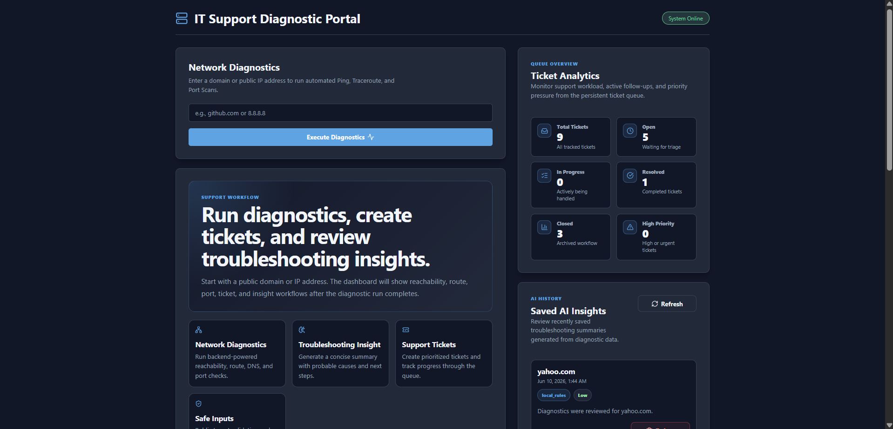
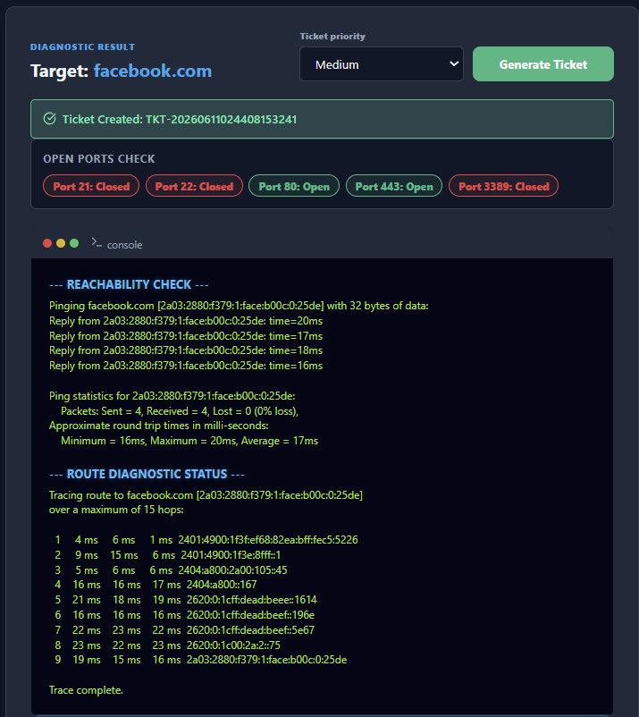
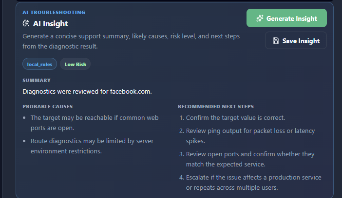
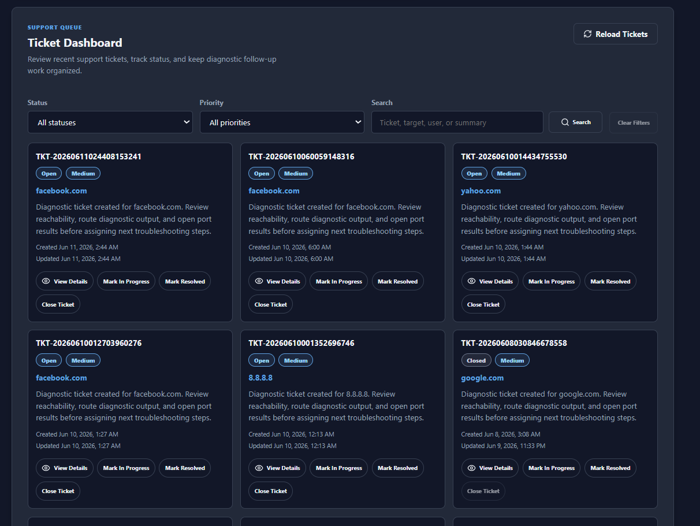

# SupportOps Diagnostic Portal — Frontend

Production-style React/Vite frontend for a full-stack IT support and diagnostic platform.

SupportOps is built around a realistic support workflow: validate a public diagnostic target, collect network evidence, review the result, generate troubleshooting guidance, create a structured ticket, and track the case through resolution.

The frontend is paired with a FastAPI backend that owns network execution, persistence, target-safety controls, AI redaction, rate limiting, and operational health checks.

## Live system

- Frontend: https://it-support-diagnostic-portal.vercel.app
- API: https://it-support-api-g0b4.onrender.com
- API docs: https://it-support-api-g0b4.onrender.com/docs
- Backend repository: https://github.com/AC0731/it-helpdesk-backend

## Engineering scope

The project goes beyond UI assembly. The current implementation demonstrates:

- React component architecture and stateful workflows
- typed API contracts at the application boundary
- bounded client request timeouts
- traceable API failures using backend request IDs
- safe handling of validation, throttling, timeout, and 5xx conditions
- display of the public IP actually pinned for diagnostics
- ticket analytics and searchable support queues
- saved troubleshooting insight history
- frontend regression tests
- dependency vulnerability auditing in CI
- production builds and Vercel deployment

## Support workflow

```text
User target
    ↓
Frontend validation / loading state
    ↓
FastAPI safety boundary
    ↓
Public-address resolution + pinning
    ↓
Reachability / route / port diagnostics
    ↓
Structured result
    ↓
Troubleshooting insight
    ↓
Ticket creation
    ↓
Queue / analytics / status updates
```

The frontend keeps network and security decisions on the backend. It never stores API/provider secrets and does not execute diagnostics directly from the browser.

## End-to-end request trace

A successful diagnostic now exposes both the pinned public address and a request reference. The same request reference is sent with ticket creation and stored in the ticket summary.

That gives the support workflow a concrete trace:

```text
UI request
  → backend request ID
  → target validation / DNS pinning
  → diagnostic result
  → diagnostic ID + request reference
  → support ticket summary
```

While working through the API failure states, I added separate handling for timeout, capacity, and persistence failures while keeping unexpected 5xx details generic.

See [`docs/failure-trace.md`](docs/failure-trace.md).

## Security and reliability behavior

### Request traceability

Backend responses include an `X-Request-ID`. User-facing errors surface that reference when available so a support report can be correlated with server-side telemetry.

### Bounded requests

Axios uses a 20-second timeout rather than leaving requests open indefinitely. Timeout errors are distinguished from backend failures and target-validation errors.

### Safe server-error handling

For 5xx responses, the frontend uses a generic operational message instead of echoing internal backend details.

### Pinned diagnostic address

The result view shows `resolved_ip`, which is the public address approved by the backend execution boundary. This makes DNS/target behavior visible during troubleshooting.

## Security finding: DNS rebinding boundary

While tracing a diagnostic request through the backend, I found a validation-to-use gap: a domain could be validated as public and then be resolved again later by the network diagnostic function.

That creates a DNS-rebinding / TOCTOU risk for any service making outbound requests on behalf of a user.

The remediation is implemented in the backend and reflected in this frontend:

- resolve again at the execution boundary
- reject the complete DNS answer set if any address is private/reserved
- select a deterministic public IP
- execute network checks against the pinned address
- return that address in the diagnostic result
- display the approved address in the UI

The backend repository preserves the regression test and fix history.

## Screenshots

### Operations dashboard



### Diagnostic result and ticket creation



### Troubleshooting insight



### Ticket operations



## Core capabilities

### Diagnostics

- public domain/IP target input
- reachability results
- route output
- common-port results
- public-address pinning visibility
- clean fallback states when system utilities are restricted

### Ticket operations

- create ticket from diagnostic evidence
- choose priority
- status lifecycle updates
- search and filtering
- analytics
- full case detail modal

### Troubleshooting insights

- probable cause summary
- recommended next actions
- risk level
- saved insight history
- duplicate protection on the backend
- delete confirmation workflow

## API error model

`src/api/client.js` centralizes request behavior.

It distinguishes:

- target validation errors
- rate-limit responses
- request timeout
- backend/server failure
- network connectivity failure

Internal server details are not displayed to the user for 5xx failures.

## Testing

```bash
npm test
npm run lint
npm run build
```

Coverage includes:

- diagnostic forms/results
- pinned address rendering
- ticket workflow
- ticket filtering/analytics
- saved insight behavior
- timeout and operational failure messages
- request-reference handling
- reusable API helpers

## CI and dependency security

GitHub Actions runs:

```text
npm ci
npm audit --omit=dev --audit-level=high
npm run lint
npm test
npm run build
```

The dependency audit surfaced vulnerable Axios/form-data versions during the security pass. The dependency graph was remediated and the final CI run is green.

Final verified frontend CI:  
https://github.com/AC0731/it-helpdesk-frontend/actions/runs/36568618101

## Architecture

```text
React / Vite
   │
   ├── API client + operational error handling
   │
   ├── Diagnostic workflow
   │
   ├── Insight workflow
   │
   └── Ticket operations
   │
   ▼
FastAPI backend
   │
   ├── target safety / SSRF boundary
   ├── diagnostics
   ├── persistence
   ├── AI redaction / rate limiting
   └── readiness / request tracing
```

See `docs/architecture.md` and the backend security documentation for deeper implementation detail.

## Tech stack

- React
- Vite
- JavaScript
- Axios
- Vitest
- Testing Library
- ESLint
- GitHub Actions
- Vercel
- FastAPI backend
- SQLAlchemy persistence

## Environment

```env
VITE_API_BASE_URL=http://127.0.0.1:8000
```

Production:

```env
VITE_API_BASE_URL=https://it-support-api-g0b4.onrender.com
```

## Local development

```bash
npm install
npm run dev
```

Default development URL:

```text
http://localhost:5173
```

## Engineering decisions

**Security boundaries stay server-side.** Browser code never decides whether a network target is safe.

**Errors are operationally useful.** User-facing errors are concise while still exposing a correlation reference.

**Failure modes are explicit.** Timeout, validation, rate limiting, and server errors are not collapsed into one generic message.

**Troubleshooting evidence remains visible.** The approved public IP, diagnostic output, insight result, and ticket record can be reviewed together.

## Repository pair

- Frontend: https://github.com/AC0731/it-helpdesk-frontend
- Backend: https://github.com/AC0731/it-helpdesk-backend

## Author

Akanksha Chavda  
GitHub: AC0731
